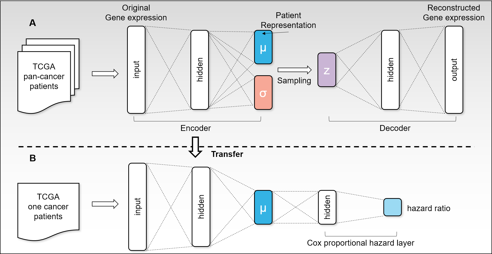

## Introduction



Recent advances in deep learning have offered solutions to many biomedical tasks. However, there remains a challenge in applying deep learning to survival analysis using human cancer transcriptome data. Since the number of genes, the input variables of survival model, is larger than the amount of available cancer patient samples, deep learning models are prone to overfitting. To address the issue, we introduce a new deep learning architecture called VAECox. VAECox employs transfer learning and fine tuning.

We pre-trained a variational autoencoder on all RNA-seq data in 20 TCGA datasets and transferred the trained weights to our survival prediction model. Then we fine-tuned the transferred weights during training the survival model on each dataset. Results show that our model outperformed other previous models such as Cox-PH with LASSO and ridge penalty and Cox-nnet on the 7 of 10 TCGA datasets in terms of C-index. The results signify that the transferred information obtained from entire cancer transcriptome data helped our survival prediction model reduce overfitting and show robust performance in unseen cancer patient samples.

## Demo

### Prerequisites
We provide toy data to run our implementation.
The full TCGA gene expression data can be downloaded in ICGC data portal.

https://dcc.icgc.org/

### Training Variational Autoencoder
```
python vae_run.py
```

### Training and evaluating VAECox
```
python main.py
```

## Authors

* Sunkyu Kim
* Keonwoo Kim 
* Junseok Choi
* Inggeol Lee 
* Jaewoo Kang - kangj@korea.ac.kr

## Publication

My paper 'Improved survival analysis by learning shared genomic information from pan-cancer data' has been accepted for presentation at ISMB 2020 and for inclusion in the conference proceedings, which will be published online in the journal Bioinformatics.   
